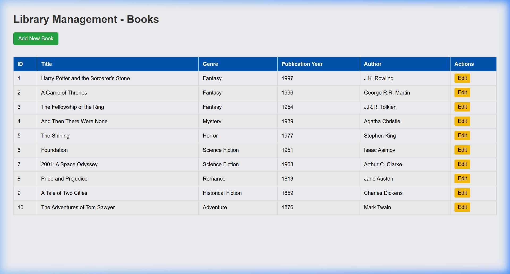
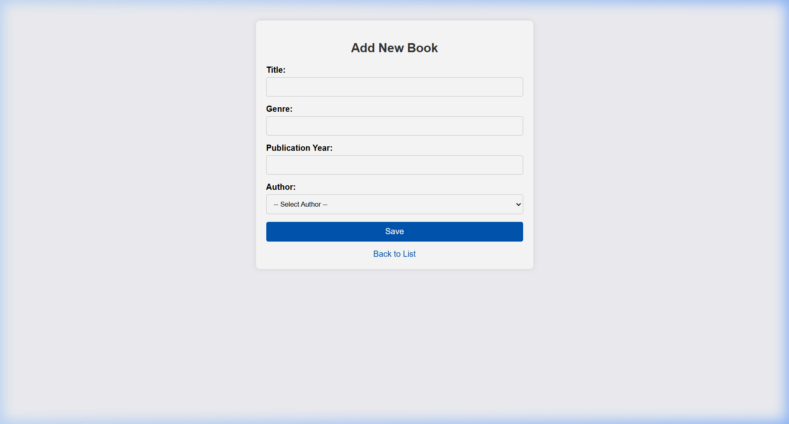
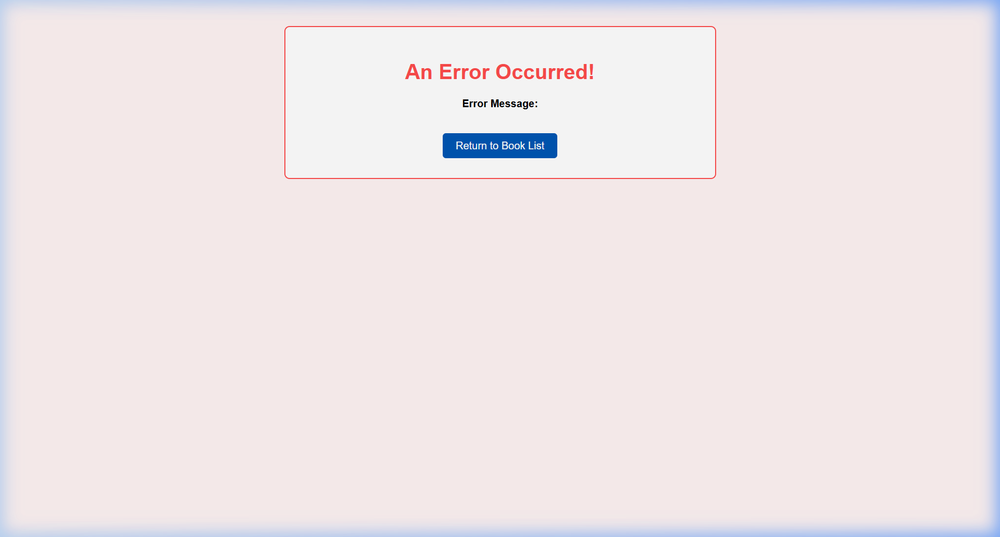

# Spring Boot Library Assignment

## Overview

This project implements a Spring Boot application managing two entities: `Author` and `Book`. It provides full CRUD (Create, Read, Update) operations via a web interface powered by JSP, and uses an in-memory H2 database with Spring Data JPA.

The relationship established between the two entities is **One-To-Many** (One Author can have multiple Books), and **Many-To-One** (Many Books can belong to one Author).

### Github Repository

[GitHub](https://github.com/rishi-harti768/bits-database-application-assignment)

## Entity Relationship Design

The database model contains two tables corresponding to the JPA entities:

- **Author**: Contains fields for `id`, `name`, and `bio`. It has a `@OneToMany` relationship with `Book`.
- **Book**: Contains fields for `id`, `title`, `genre`, and `publicationYear`. It has a `@ManyToOne` relationship mapping to the `Author` through `author_id`.

```java
// Author.java
@OneToMany(mappedBy = "author", cascade = CascadeType.ALL, orphanRemoval = true)
private List<Book> books = new ArrayList<>();

// Book.java
@ManyToOne(fetch = FetchType.LAZY)
@JoinColumn(name = "author_id", nullable = false)
private Author author;
```

## Implementation Details

### 1. Database Population

A `DataInitializer` class implementing `CommandLineRunner` is utilized to prepopulate the database with 10 sample Authors and 10 sample Books automatically on startup.

### 2. Create and Update Operations

The `LibraryController` provides mappings to display a shared form (`form.jsp`) used for both Creating and Updating books. A form submission routes to either `/books/save` or `/books/update`.
If any Data Integrity constraints are violated (e.g., trying to add a duplicate unique field or missing fields), a custom `DataIntegrityViolationException` is handled and routed to an `error.jsp` page, which provides a safe mechanism for the user to return to the list.

### 3. Read Operation and Custom Inner Join Query

Listing books involves reading data from the service layer via `LibraryService.getAllBooks()`.
In `BookRepository.java`, a custom JPQL query performs an inner join fetch to avoid N+1 querying issues when loading Authors with their Books:

```java
@Query("SELECT b FROM Book b JOIN FETCH b.author")
List<Book> findAllBooksWithAuthor();
```

The data is then rendered dynamically using JSTL in `list.jsp`.

## Screenshots







## Challenges Faced & Solutions

1. **Handling Foreign Key selection on JSP Forms**: Passing the selected `Author` correctly back to the `Book` object. Overcame this by using `name="author.id"` in the HTML `<select>` input, allowing Spring MVC to auto-map the relationship via ID.
2. **JSP Integration in Spring Boot 3/4**: Spring Boot modern versions require Jakarta EE libraries. We ensured `jakarta.servlet.jsp.jstl-api` and `tomcat-embed-jasper` dependencies were correctly mapped in `pom.xml` instead of legacy `javax` APIs.
3. **Data Integrity Violation Handling**: Configured a global or controller-level `try/catch` mechanism that intercepts constraints gracefully and redirects to an error page rather than throwing a white-label error page to the user.
